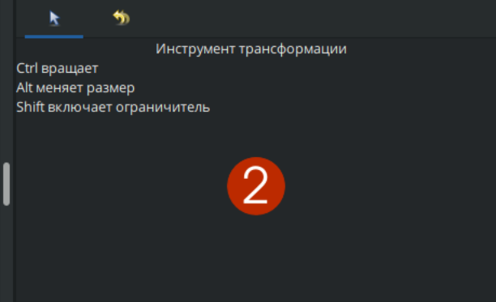
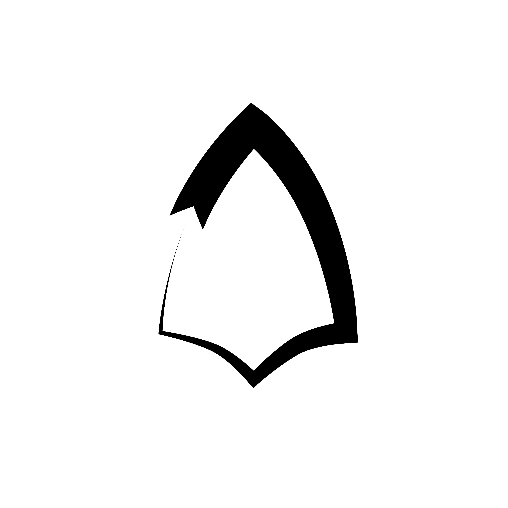

# Расширенный контур

**Расширенный контур** – это усовершенствованный слой «контур» с дополнительными параметрами, обеспечивающий более гибкое и точное управление контуром фигуры.

### **Создание слоя «Расширенный контур»**

Существует несколько способов создать "расширенный контур":

* На панели слоёв с помощью кнопки "создать слой" вызовите контекстное меню, выберите "геометрия" - "Расширенный контур";

<figure><figcaption></figcaption></figure>

* С помощью инструментов, которые создают редактируемые фигуры (в том числе инструмент "кривые"). Для этого выберите нужный инструмент и в параметрах этого инструмента кликните на иконку с расширенным контуром. После создания фигуры, создастся и "расширенный контур".

<figure><figcaption></figcaption></figure>

### **Отличия от слоя «Контур»**

В обычном слое «Контур» каждая упрвляющая шириной точка связан с вершиной, определяющей форму контура в конкретном месте.&#x20;

В расширенном контуре управляющие шириной точки свободно перемещаются по кривой и определяют там, куда эти точки перенесли.

### Параметры, отличные от стандартного контура:

1\) Тип кончика в начале/конце - определяет тип концов у незамкнутой кривой:

| Тип                               | Отображение                                                                        |
| --------------------------------- | ---------------------------------------------------------------------------------- |
| Закругленная остановка            | 

 |
| Квадратная остановка              | 

 |
| Заострённая остановка             | 

 |
| Плоская остановка                 | 

 |
| Внутренняя закруглённая остановка | 

 |
| Незаострённая остановка           | 

 |

2\) Тип пиков - определяет отображение пиков.

| Тип        | Отображение                                                                               |
| ---------- | ----------------------------------------------------------------------------------------- |
| Резкий     | 

 |
| Скругление | 

        |
| Фаска      | 

        |

3\) Плавность - определяет плавность перехода между точками ширины, где 0 - это линейная, а 1 - плавная.

<figure><figcaption></figcaption></figure>

4\) Пунктирная линия - когда функция включена, превращает сплошной контур в пунктирный.

<figure><figcaption></figcaption></figure>

Параметры **точки ширины** в "Расширенном контуре":

<figure><figcaption></figcaption></figure>

* Положение - определяет позицию точки на кривой;
* Ширина;
* Тип стороны до/после - определяет тип интерполяции (отображения) по ширине точки;


В таблице ниже представлен пример отображения типов интерполяции для точки ширины. На примере интерполяция меняется только у одной точки (слева).


| Тип интерполяции                  | Отображение                                                                    |
| --------------------------------- | ------------------------------------------------------------------------------ |
| Интерполяция                      |                |
| Закругленная остановка            | 

 |
| Квадратная остановка              | 

 |
| Заострённая остановка             | 

 |
| Плоская остановка                 | 

 |
| Внутренняя закруглённая остановка | 

 |
| Незаострённая остановка           | 

 |

* Нижняя/верхняя граница - определяет позицию в начале кривой.

