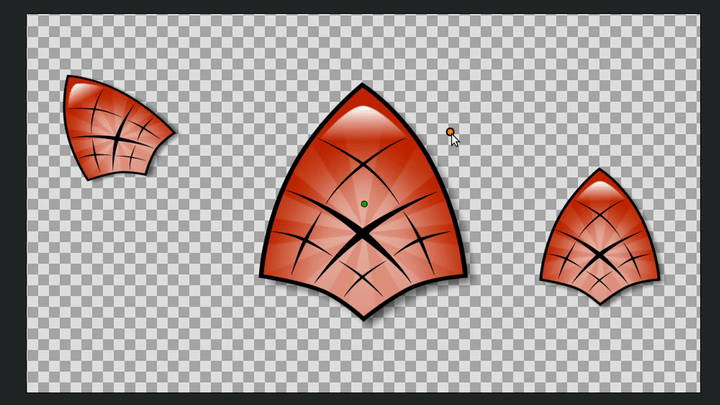

# Растяжение

Слой "Растяжение" - искажает нижележащие слои по обеим осям.

У данного слоя всего два параметра:

* Величина - размер растяжения относительно центра;
* Центр - расположения центра растяжения.

<figure><figcaption></figcaption></figure>
