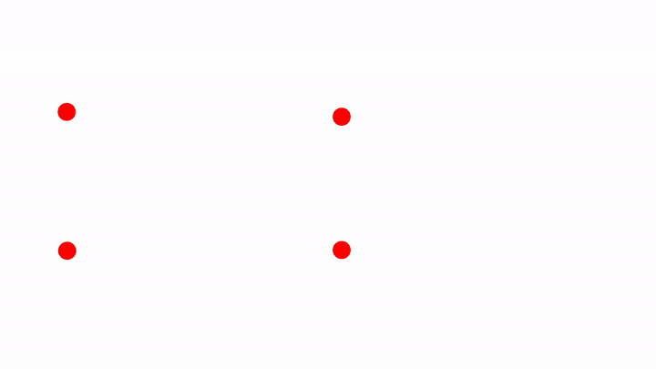
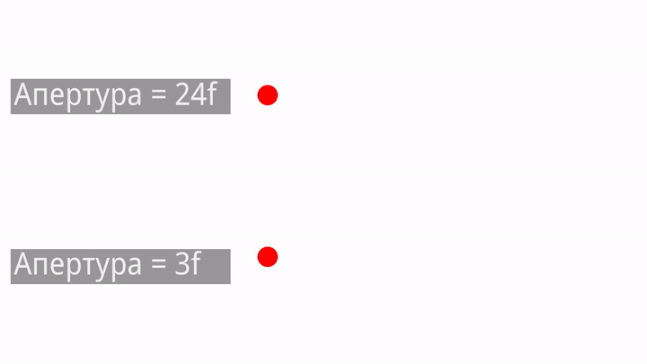
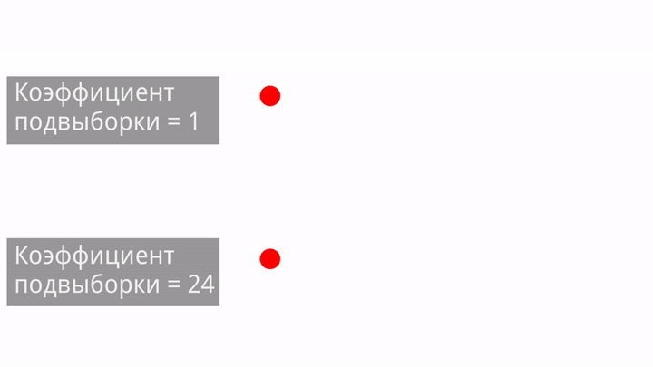
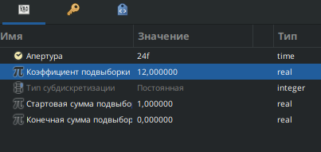
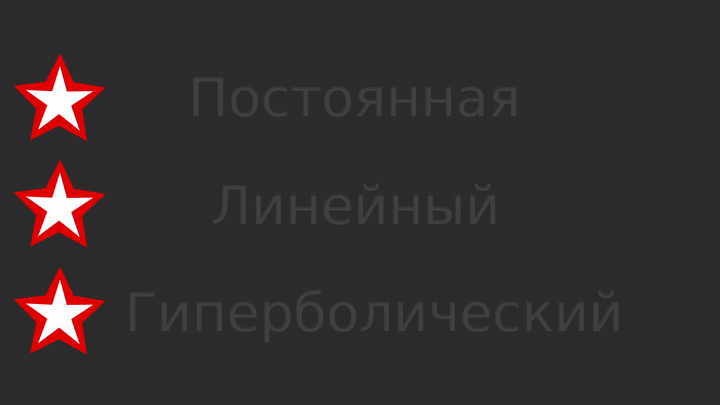

# Размывание движением

<figure><figcaption>
Размывание движением
</figcaption></figure>

 - Размывание движением - слой фильтр, который позволяет имитировать размытие, возникающее при движении объекта.&#x20;


На рис. 1 представлен пример работы фильтра "Размывание движением" в комбинации с [анимацией вдоль кривой](../instrumenty-animacii/animaciya-vdol-krivoi.md).


Размытие - это графический эффект, имитирующий изображение вне фокуса.

В фотографии размытие может возникнуть, когда точка фокусировки объектива не совпадает с объектом съемки. Существуют и другие причины размытия:

* **Неправильная экспозиция:** Длительная выдержка при движении объекта или камеры может привести к размытию.
* **Широкая диафрагма:** При использовании очень широкой диафрагмы (f4) объекты вне зоны фокуса будут размыты сильнее, чем при полностью закрытой диафрагме (f22).

В графическом дизайне фильтры размытия имитируют эти эффекты с большей или меньшей степенью реалистичности.

## Параметры слоя "Размывание движением"

### Апертура

Параметр «Апертура» указывает на количество кадров, используемых для расчета эффекта движения. Концепция аналогична выдержке или времени экспозиции в фотографии. Чем больше значение апертуры, тем большее количество кадров учитывается при размытии, тем сильнее будет эффект размытия.

<figure><figcaption>
Размывание движением, параметр "апертура"
</figcaption></figure>

### Коэффициент подвыборки

Параметр «коэффициент подвыборки» влияет на количество вычисляемых подсэмплов. Использование высокого значения приводит к более тонкому размытию, но при этом рендеринг занимает больше времени из-за большого объема вычислений.

<figure><figcaption>
Размывание движением, параметр "коэффициент подвыборки"
</figcaption></figure>

### Тип субдискретизации

Параметр «Тип субдискретизации» определяет используемый метод субдискретизации:

* **Постоянный:** Размытие одинаково сильно на протяжении всей анимации.
* **Линейный:** Размытие постепенно нарастает от начального значения к конечному.
* **Гиперболический:** Размытие резко нарастает в начале и затем плавно увеличивается.

<figure><figcaption>
Размывание движением, параметр "тип субдискретизации"
</figcaption></figure>


На гиф выше используются следующие настройки:



### Стартовая сумма подвыборки (ССП)

Параметр «Стартовая сумма подвыборки» определяет силу размытия в первом кадре анимации. Значение **0** означает полное отсутствие размытия в начале. Значение **больше 0** задаёт начальную степень размытия. Чем выше значение, тем сильнее будет размыто изображение в первом кадре.

### Конечная сумма подвыборки (КСП)

Параметр «Конечное значение подсэмплинга» определяет силу размытия в последнем кадре анимации. Значение **0** означает полное отсутствие размытия в конце. Значение **больше 0** задаёт конечную степень размытия. Чем выше значение, тем более размытым будет изображение в финальном кадре.

<figure><figcaption>
Размывание движением, параметры "Стартовой/конечной сумм подвыборки"
</figcaption></figure>

**Ниже представлена таблица, которая демонстрирует работу слоя фильтра "Размывание движением".**&#x20;

В столбце слева обозначен параметр апертура: 0f-0f значит, что значение параметра апертура неизменно и равна 0, 0f-24f значит, что значение параметра анимировано и постепенно меняется с 0 до 24 и т.д..

В строке сверху обозначены значения стартовой и конечной сумм подвыборки.

Три звезды обозначают типы субдискретизации: сверху - "постоянная", по центру - "линейный", снизу - "Гиперболический".

<table><thead><tr><th width="119">Апертура</th><th width="316">ССП = 1, КСП = 0</th><th>ССП = 0, КСП = 1</th></tr></thead><tbody><tr><td>0f–0f</td><td></td><td></td></tr><tr><td>0f–24f</td><td></td><td></td></tr><tr><td>24f–24f</td><td></td><td></td></tr><tr><td>24f–0f</td><td></td><td></td></tr></tbody></table>

