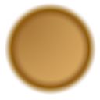
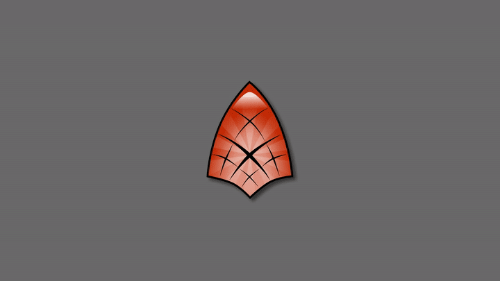
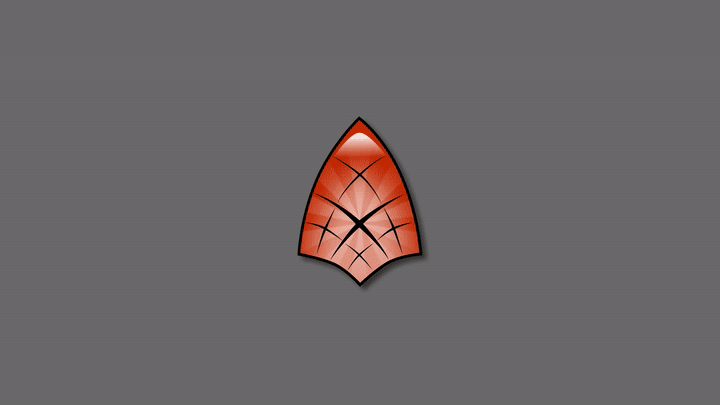
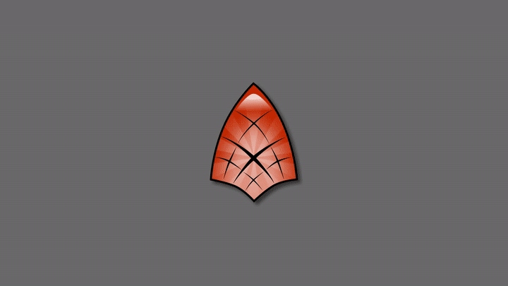
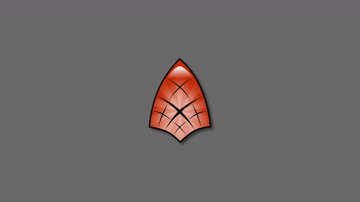
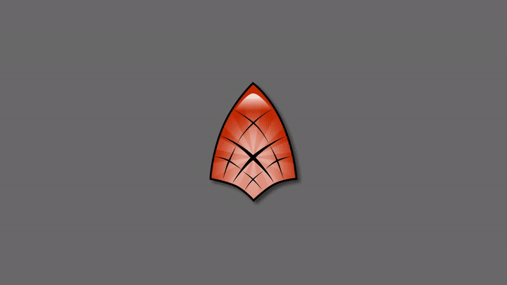
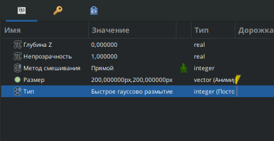

# Размывание

Размывание - это визуальный эффект, применяемый для создания изображения вне фокуса.

В фотографии размывание возникает по нескольким причинам:

* **Неточная фокусировка:** Если точка фокусировки объектива не совпадает с объектом съемки, изображение получится размытым.
* **Длинная выдержка:** При использовании длинной выдержки для съемки движущихся объектов или при перемещении камеры во время съемки возникает эффект размытия движения.
* **Широкая диафрагма:** Применение широкой диафрагмы (f4) приводит к тому, что объекты вне зоны фокуса размываются сильнее, чем при использовании закрытой диафрагмы (f22).

В компьютерной графике фильтры размытия имитируют эти фотографические эффекты, стремясь к большей или меньшей степени реалистичности.

**Параметры слоя Размывание**

### Размер

Параметр «Размер» управляет степенью размытия. В зависимости от его значения эффект размытия может быть различным.&#x20;

<figure><figcaption>
Размывание по оси X
</figcaption></figure>

Данный параметр является составным значением из двух действительных чисел: x и y. Каждое из них определяет размер размытия по соответствующей оси (x - горизонтальная, y - вертикальная).

<figure><figcaption>
Размывание по оси Y
</figcaption></figure>

### Тип размытия

Существует 5 типов размытия:

* **Квадратичное размытие:** Создает размытие прямоугольной формы, похоже на Гауссово размытие.

<figure><figcaption>
<strong>Квадратичное размытие</strong>
</figcaption></figure>

* **Быстрое Гауссово размытие:** Обеспечивает баланс между качеством и скоростью.

<figure><figcaption>
<strong>Быстрое Гауссово размытие:</strong>
</figcaption></figure>

* **Перекрестное размытие:** Создает размытие в виде пересекающихся линий.

<figure><figcaption>
<strong>Перекрестное размытие</strong>
</figcaption></figure>

* **Дисковое размытие:** Создает размытие круглой формы.

<figure><figcaption>
<strong>Дисковое размытие</strong>
</figcaption></figure>

* **Гауссово размытие:** Обеспечивает более плавное размытие по сравнению с быстрым вариантом, однако занимает намного больше времени рендера.

<figure><figcaption>
<strong>Гауссово размытие</strong>
</figcaption></figure>


Для демонстрации размывания был анимирован параметр "размер". Его значение изменялось от 0px, 0px до 200px, 200px c 0 по 120 кадр:



