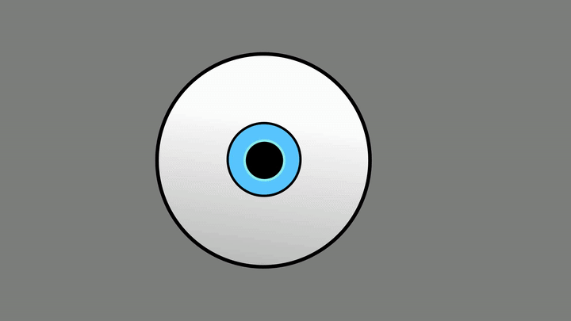
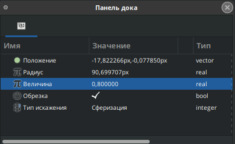
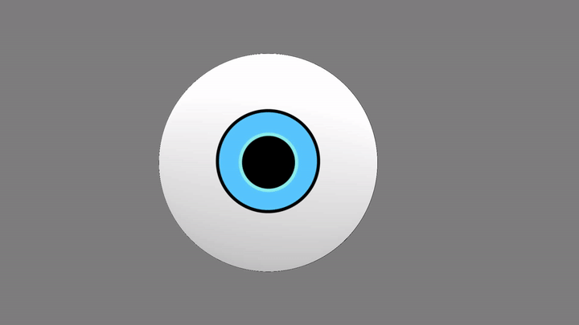
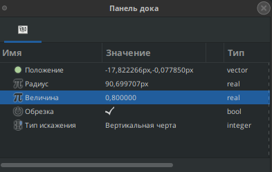
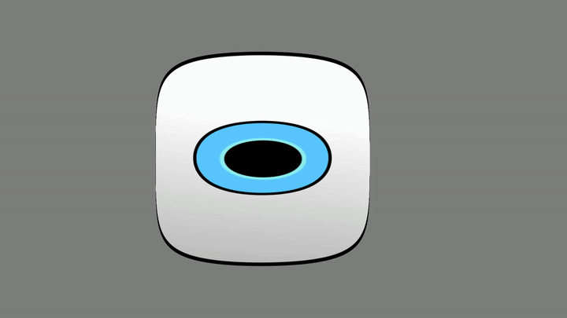
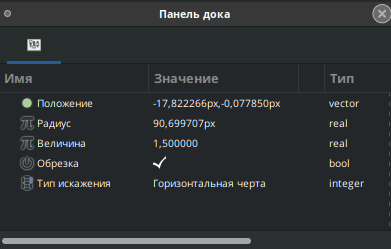
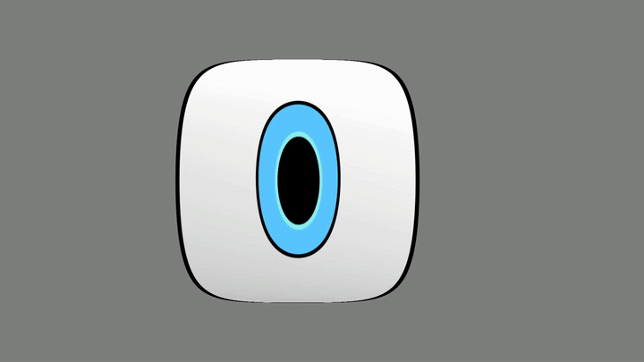

# Сферизация

Слой "Сферизация" искажает объект по сфере.&#x20;

Параметры слоя сферизация:

* Радиус - определяет размер сферического искажения;
* Величина - сила искажения (отрицательные значения инвертируют эффект);
* Обрезка - если опция включена, то область вне радиуса не искажается;
* Тип искажения - определяет направление искажения (по сфере, по вертикали, по горизонтали).

| Параметры                                                                | Результат                                                                         |
| ------------------------------------------------------------------------ | --------------------------------------------------------------------------------- |
| Слой "сферизация" выключен                                               | 

 |
|        |               |
|  |               |
|  |               |

В таблице ниже представлена работа фильтра при различных параметрах.&#x20;

| Тип искажения/Величина | 1                                                                         | -1                                                                         |
| ---------------------- | ------------------------------------------------------------------------- | -------------------------------------------------------------------------- |
| Сферизация выключена   |       |                                                                            |
| Сферизация             |  |  |
| Вертикальная черта     |     |     |
| Горизонтальная черта   |   |   |
