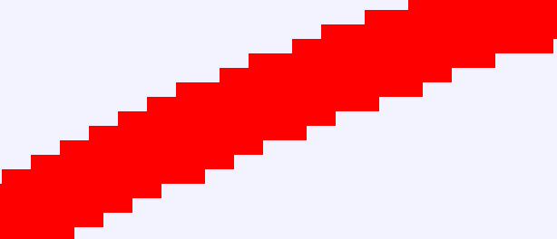
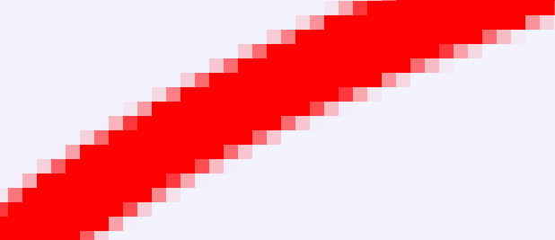
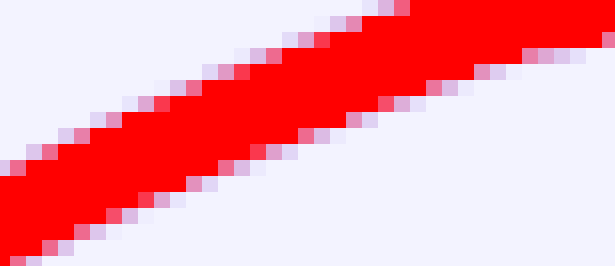

# Сглаживание

.png>)

Слой **Сглаживание** используется для сглаживания всех слоев, находящихся под ним.

> **Примечание:** Использование этого слоя требуется нечасто, так как большинство слоев уже обеспечивают плавный вывод.

#### Параметры

* **Ширина** — множитель по горизонтали.
* **Высота** — множитель по вертикали.

При применении слоя сцена сначала визуализируется в `<ширину>` раз шире и в `<высоту>` раз выше выходного изображения, а затем каждый блок размером `<ширина>` × `<высота>` усредняется до одного пикселя.

> **Совет:** Увеличение множителей повышает качество сглаживания, но может значительно увеличить время рендеринга.


Стоит учесть, что результат сглаживания видно только после рендера, во время редактирования результат воздействия слоя на рабочей области не отображается.&#x20;


Вы указываете параметры **Ширина** и **Высота**. Внутри сцена визуализируется в `<ширину>` раз шире и в `<высоту>` раз выше выходного изображения. После этого каждый блок размером `<ширина>` × `<высота>` усредняется до одного пикселя.

**Пример**

Допустим, выходное изображение имеет размер `320x240` пикселей, а параметры слоя суперсэмплинга установлены по умолчанию:

* **Ширина:** 2
* **Высота:** 2

В этом случае Synfig выполнит следующие действия:

1. Внутренне изображение будет размером `640x480` пикселей (в 2 раза шире и выше).
2. Каждый блок `2x2` пикселя усредняется до одного пикселя.
3. Полученный пиксель используется в выходном изображении размером `320x240`.

Здесь показано увеличенное изображение контура с отключенным сглаживанием и без слоя **суперсэмплов**:



Флажок «Использовать параметрический» позволяет использовать [Параметрический рендеринг](/docs/index.php?title=Parametric_renderer\&action=edit\&redlink=1) вместо стандартного [Ускоренный рендеринг](/docs/index.php?title=Accelerated_renderer\&action=edit\&redlink=1).

Параметр **«Не затрагивать прозрачность»** определяет, учитывается ли альфа-канал при процессе усреднения пикселей.

*   **Если галочка включена:**\
    Среднее значение цвета рассчитывается как:

    ```
    среднее = sum(цвет × альфа) / sum(альфа)
    альфа = sum(альфа) / sum(1)
    ```

Рассмотрим усреднение двух пикселей:

**Пиксель 1:** полностью прозрачный синий

```abap
R: 0, G: 0, B: 1, A: 0
```

**Пиксель 2**: непрозрачный красный

```abap
(R: 1 G: 0 B: 0 A: 1)
```

**При включённой альфа-безопасности («Не затрагивать прозрачность»):**\
Среднее значение цвета:

```abap
(R: 1 G: 0 B: 0 A:0.5)
```

**При отключённой альфа-безопасности:**\
Среднее значение цвета:

```abap
R: 0.5, G: 0, B: 0.5, A: 0.5
```


**Совет:** Используйте альфа-безопасность, если прозрачные пиксели не должны влиять на усреднение цвета.


Это тот же контур, что и раньше, но поверх него нанесен слой **супер-сэмплов**. На этот раз включена функция «Не затрагивать прозрачность»:



И на этом слое нет надписи «Be Alpha Safe». Фон ярко-синий, но с очень низкой альфа-частотой. Края намного синее, чем они были бы, если бы учитывалась альфа:



Стоит отметить, что слой **супер-сэмплов** отключается, когда параметр «**Качество**» равен `10` или выше. Во время редактирования качество равно `10`.

Если вы хотите увидеть эффект слоя **Супер-сэмплы**, выполните следующие шаги:

1. Создайте контур и **отключите его параметр «Сглаживание»**.
   * Контур будет выглядеть неровным по краям.
2. Добавьте слой **Супер-сэмплы** поверх контура.
3. Сохраните файл проекта и визуализируйте его в виде изображения с помощью команд:
   *   Для низкого качества (с сохранением неровностей):

       ```bash
       synfig -Q 10.sif
       ```
   *   Для более гладкого результата:

       ```bash
       synfig -Q 9.sif
       ```

**Примеры**

<figure><figcaption><p>ширина= 1 высота = 1</p></figcaption></figure>

То же самое без слоя «**Сглаживание**»


<figure><figcaption><p>ширина = 2 высота = 2</p></figcaption></figure>

Обратите внимание, что для сглаживания используется только один промежуточный цвет в самом нижнем правом углу.


<figure><figcaption><p>ширина = 3 высота = 3</p></figcaption></figure>

Теперь используются два промежуточных цвета, и результат получается более плавным


<figure><figcaption><p>ширина = 4 высота = 4</p></figcaption></figure>

Это выглядит неплохо, но слой супер-сэмплов размером `4x4` увеличивает время рендеринга в 16 раз


<figure><figcaption><p>ширина = 4, высота = 1</p></figcaption></figure>

Вертикальные линии ровные, горизонтальные - неровные


<figure><figcaption><p>ширина = 1, высота = 4</p></figcaption></figure>

Горизонтальные линии ровные, вертикальные - неровные
