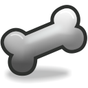

# Скелет

Скелет - это слой который помогает управлять более сложными объектами с помощью костей.

**Параметры слоя Скелета:**\

| Имя                                                                                                                                                                                 | Значение           | Тип    |
| ----------------------------------------------------------------------------------------------------------------------------------------------------------------------------------- | ------------------ | ------ |
|  Глубина Z      | 0.000000           | real   |
|  Непрозрачность | 0.500000           | real   |
|  Имя    | skeleton           | string |
|  Кости          | list (Static List) | list   |

_Побробнее о работе данного слоя смотрите статью "Создание слкелета"  в разделе "Скелетная анимация"._
