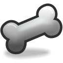

# Скелет

Скелет — это слой который помогает управлять более сложными объектами с помощью **костей**.

**Параметры слоя Скелета:** 

| Имя                                                                                                                                                                           | Значение           | Тип    |
| ----------------------------------------------------------------------------------------------------------------------------------------------------------------------------- | ------------------ | ------ |
|  Глубина Z      | 0.000000           | real   |
|  Непрозрачность | 0.500000           | real   |
|  Имя    | skeleton           | string |
|  Кости          | list (Static List) | list   |


Подробнее о работе данного слоя смотрите статью «_Создание скелета_»  в разделе «_Скелетная анимация_»_._

