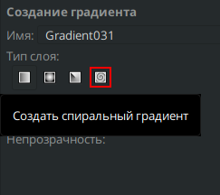
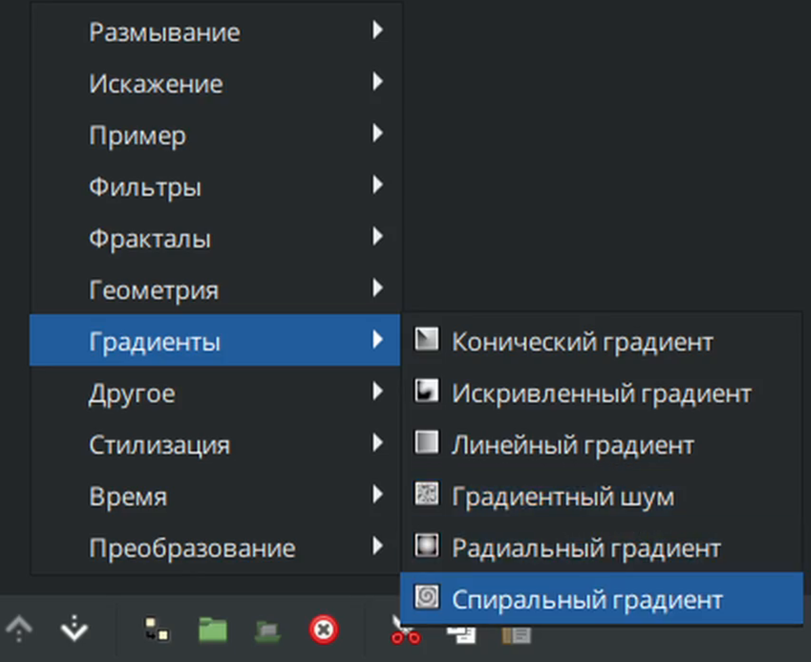

# Спиральный градиент

Спиральный градиент в Synfig Studio предназначен для создания градиентной заливки, следующей по спиральной траектории. Градиент может вращаться по часовой стрелке или против часовой стрелки, а его параметры, такие как центр, радиус и начальный угол, задаются пользователем.

### **Создание слоя "Спиральный градиент"**

Существует несколько способов создать "Спиральный градиент":

* С помощью [инструмента создания градиентов](../osnovnye-principy/instrumenty.md#instrument-gradient), выбрав на панели настройки инструмента "спиральынй градиент".

<figure><figcaption></figcaption></figure>

На панели слоёв с помощью кнопки "создать слой" вызовите контекстное меню, выберите "градиенты" - "Спиральный градиент";

<figure><figcaption></figcaption></figure>

### Параметры слоя “Спиральный градиент” 

|  Глубина Z           | 0,000000                                                                                                                                                                                                                | реальный     |
| ---------------------------------------------------------------------------------------------------------------------------------------------------------------------------------------------------------------------------------------------------------------------- | ----------------------------------------------------------------------------------------------------------------------------------------------------------------------------------------------------------------------- | ------------ |
|  Непрозрачность      | 1,000000                                                                                                                                                                                                                | реальный     |
|  Метод смешивания | Совмещение                                                                                                                                                                                                              | целое число  |
|  Градиент        |      | градиент     |
|  Центр             | 0,500000px, 0,000000px                                                                                                                                                                                                  | векторный    |
|  Радиус              | 0,500000px                                                                                                                                                                                                              | реальный     |
|  Угол               | 0.00                                                                                                                                                                                                                    | угол наклона |
|  По часовой стрелке  |  | bool         |
