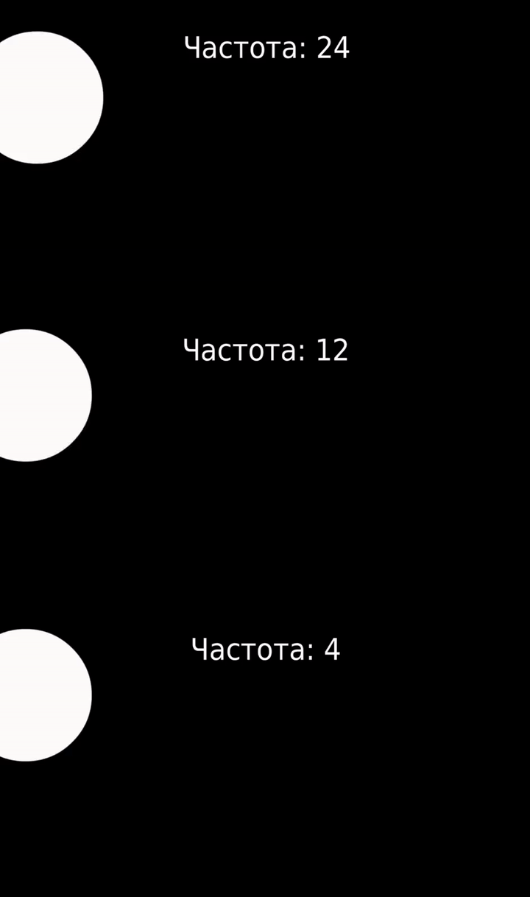

# Стробоскоп

Слой стробоскопа показывает слои под ним через равные промежутки времени, а затем замораживает их на оставшуюся часть интервала. Это похоже на уменьшение частоты кадров анимации при сохранении ее продолжительности.&#x20;

**Параметры слоев стробоскопа следующие:**

| Имя                                                                                                                                                                                                         | Значение  | Тип      |
| ----------------------------------------------------------------------------------------------------------------------------------------------------------------------------------------------------------- | --------- | -------- |
|  Глубина Z | 0.000000u | реальный |
|  Частота   | 2.000000u | реальный |

У слоя есть единственный параметр, называемый “Частота” (в разах в секунду), который определяет, как часто берутся кадры. Частота, равная частоте кадров в секунду в вашем проекте, не повлияет на вашу анимацию, в то время как меньшие частоты будут отображаться так, как если бы вы снизили частоту кадров до этой величины.

<figure><figcaption></figcaption></figure>


С помощью слоя у вас может получиться 2 разные анимации с двумя разными частотами кадров в одном проекте. Например,  если вы сгруппируете стробоскоп с вашей анимацией и установите частоту 12, то анимация секвенции будет проигрываться 12 кадров в секунду. При этом, плавный паралакс так и останется на частоте 24 кадра в секнду&#x20;


