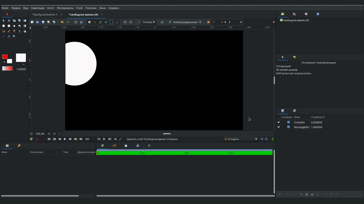

# Свободное время

<figure><figcaption></figcaption></figure>

Слой "Cвободное время" позволяет управлять течением времени анимации для нижележащих слоёв. Эта функци полезна для ре-тайминга анимации, реверса анимации, создания эффекта слоу-мо (slow-mo), а также для многократного использования сегментов анимации.

**Параметры слоя "Свободное время"**

| Имя                                                                                                                                                                                                         | Значение | Тип  |
| ----------------------------------------------------------------------------------------------------------------------------------------------------------------------------------------------------------- | -------- | ---- |
|  Глубина Z | 0.000000 | real |
|  Время                                                                                                                             | 0f       | time |


Параметр слоя **"Время"** определяет какой кадр нижележащих слоёв отображается в данный момент. Его значение по-умолчанию - ноль. Поэтому, после добавления слоя **"Свободное время",** анимация нижележащих слоёв перестанет воспроизводиться и _вместо этого на всём промежутке времени будет отображаться только нулевой кадр._&#x20;


<figure><figcaption></figcaption></figure>

&#x20;Изменяя параметр "Время" в режиме анимации, вы можете задавать скорость и направление течения времени.

Например, у нас есть анимация из 96-ти кадров. Установив на нулевом кадре значение "0", на 72-м кадре значние 24, а на 96-м кадре ставим значение 96, мы получим эффект замедленного воспроизведения анимации за 72 кадров и затем ускоренное воспроизведение всей оставшейся анимации за следующие 24 кадра.

<figure><figcaption>
эффект slow-mo
</figcaption></figure>

Для [фиксаторов](../osnovnye-principy/fiksatory.md), которые создаются для параметра "Время" можно задавать сглаженные типы интерполяции ("Сгладить", "TCB" или "Плавный вход/выход"), что создаёт плавность при переходе между различными промежутками скорости и поэтому изменения скорости смотрятся комфортно и естественно. Можно также использовать тип интерполяции "Постоянная" для создания резких скачков от одного состояния к другому.
