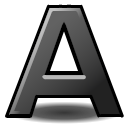

# Текст

### &#x20;


Для того, чтобы узнать как работает данный слой смотрите раздел "Инструменты"


**Параметры текстовых слоев следующие:**

| **Имя**                                                                                                                                                                                                                             | **Значение**                                                                                                                 | **Тип**     |
| ----------------------------------------------------------------------------------------------------------------------------------------------------------------------------------------------------------------------------------- | ---------------------------------------------------------------------------------------------------------------------------- | ----------- |
|  Параметр глубины Z                | 0.000000                                                                                                                     | реальный    |
|  Непрозрачность                    | 1.000000                                                                                                                     | реальный    |
|  Метод наложения          | Композитный                                                                                                                  | целое число |
|  Текст                       | Текстовый слой                                                                                                               | строка      |
|  Диалоговое окно цвета |    | Цвет        |
|  Семейство шрифтов        | Без засечек                                                                                                                  | строка      |
|  Стиль                    | Nomral                                                                                                                       | целое число |
|  Вес                      | Нормальный                                                                                                                   | целое число |
|  Горизонтальный интервал           | 1.000000                                                                                                                     | реальный    |
|  Вертикальный интервал             | 1.000000                                                                                                                     | реальный    |
|  Размер                      | 0.500000u,0.500000u                                                                                                          | векторный   |
|  Ориентация                  | 0.500000u,0.500000u                                                                                                          | векторный   |
|  Происхождение               | 0.00000u,0.000000u                                                                                                           | векторный   |
|  Кернинг                           |  | bool        |
|  Заострите края                    |  | bool        |
|  Перевернутый                      |  | bool        |
