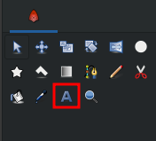
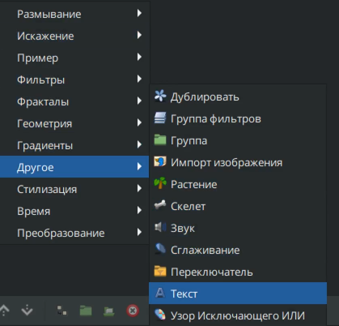

# Текст

### &#x20;

### **Создание слоя "Текст"**

Существует несколько способов создать "Текст":

* С помощью [инструмента создания Текста](../osnovnye-principy/instrumenty.md#tekst).

<figure><figcaption></figcaption></figure>

* На панели слоёв с помощью кнопки "создать слой" вызовите контекстное меню, выберите "Другое" - "Текст";

<figure><figcaption></figcaption></figure>

**Параметры текстовых слоев следующие:**

| **Имя**                                                                                                                                                                                                                  | **Значение**                                                                                                                 | **Тип**     |
| ------------------------------------------------------------------------------------------------------------------------------------------------------------------------------------------------------------------------ | ---------------------------------------------------------------------------------------------------------------------------- | ----------- |
|  Глубина Z                 | 0.000000                                                                                                                     | реальный    |
|  Непрозрачность            | 1.000000                                                                                                                     | реальный    |
|  Метод смешивания | Совмещение                                                                                                                   | целое число |
|  Текст               | Текстовый слой                                                                                                               | строка      |
|  Цвет          |    | Цвет        |
|  Гарнитура           | Sans Serif                                                                                                                   | строка      |
|  Начертание       | Обычное                                                                                                                      | целое число |
|  Насыщенность     | Обычное                                                                                                                      | целое число |
|  Межбуквенное расстояние   | 1.000000                                                                                                                     | реальный    |
|  Межстрочное расстояние    | 1.000000                                                                                                                     | реальный    |
|  Размер              | 0.500000px, 0.500000px                                                                                                       | векторный   |
|  Ориентация          | 0.500000px, 0.500000px                                                                                                       | векторный   |
| Центр                | 0.00000px, 0.000000px                                                                                                        | векторный   |
|  Кернинг                   |  | bool        |
|  Резкость краёв            |  | bool        |
|  Инвертировать             |  | bool        |
