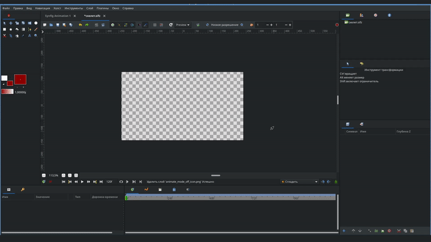

# Импорт изображений

Для того чтобы импортировать изображения в Synfig, из верхнего меню выберите "Файл" - "Импортировать". Далее находим нужную папку и в ней выбираем нужное изображение , нажимаем “импортировать”.

<figure><figcaption>
Импорт изображения
</figcaption></figure>

Также можно просто перетащить изображение из папки на рабочую область, после чего изображение отобразиться на рабочей области и появится на панеле “Слоев”

<figure><figcaption>
Импорт изображения
</figcaption></figure>


Рекомендуем для работы с программой использовать изображения разрешения PNG, чтобы не терялось качество, а также сохраняемые вами объекты были на прозрачном фоне.

