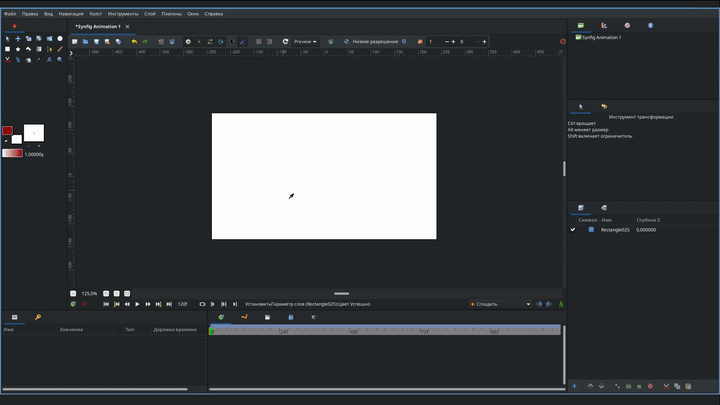

# Импорт секвенций кадров

Для того, чтобы импортировать секвенцию кадров нужно выбрать в верхнем меню “Файл” - “Импортировать последовательность” и далее выбираете всю секвенцию кадров, которую хотите импортировать и далее кнопка ”загрузить”. Если формат секвенций достаточно большой, то это может занять некоторое время, стоит просто подождать. Таким образом, импортированная вами секвенция, отображается на панеле слоев как папка переключатель(подробнее можно узнать в разделе липсинг)

<figure><figcaption>
Импорт секвенций
</figcaption></figure>
