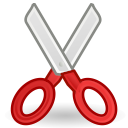

# Инструмент Ножницы

<figure><figcaption></figcaption></figure>

Инструмент позволяющий разрезать любые слои. Будь это слой-фильтр или простой объект. Он расположен на параметрах с другими инструментами.

<figure><figcaption></figcaption></figure>

Как только вы его выберете, то курсор мышки станет кардашом. Выделите слой который вам нужно отредактировать и  просто “обвидите” то, что хотите  вырезать. После этого, на панели слоев автоматически появится группа, в которой находится **маска** и слой с редактируемым объектом.

&#x20;

<figure><figcaption></figcaption></figure>

Если вы уберете галочку напротив слоя с маской, то объект вернется в исходную позицию.&#x20;

Выделим слой маску на параметре слоев и возьмем инструмент “трансформация” то контур нашей маски можно изменять и придать более аккуратный вид с помощью точек вершин и 2-мя усиками, что отходят от них.&#x20;


Маску также можно анимировать, по этому будьте внимательны, когда работаете в режиме анимации.&#x20;


<figure><figcaption></figcaption></figure>

Через панель “Параметры” можно менять параметры у слоя-маски, такие как непрозрачность, метод наложения, растушевка и.т.д. Кликнув дважды на значения параметра.\
_Подробную информацию смотрите в разделе "Инструменты"._
