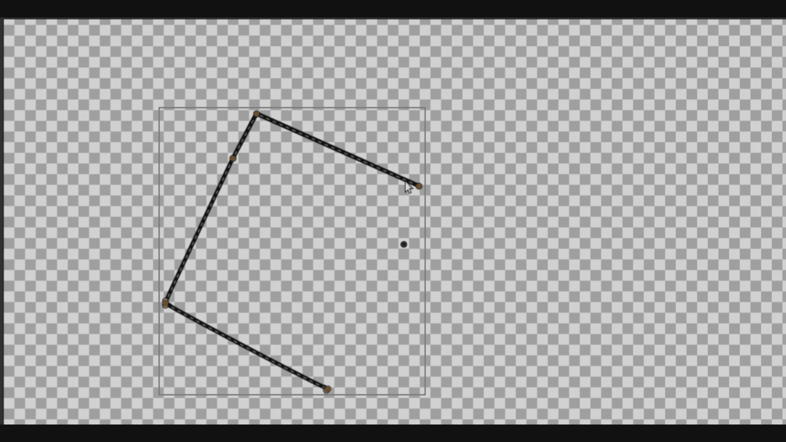

# Редактирование векторных кривых

Synfig Studio предоставляет широкий спектр для редактирования и тонкой настройки векторных кривых.

Векторные кривые позволяют создавать и точно настраивать контуры объектов. После создания кривой её можно редактировать, изменяя положение вершин и их параметры.

#### Редактирование касательных

Каждая вершина кривой может иметь касательные (направляющие), определяющие форму изгиба в этой точке.

<figure><figcaption></figcaption></figure>

Перемещение касательных позволяет:

* изменять радиус и направление изгиба;
* создавать плавные или резкие переходы между сегментами;
* формировать симметричные или асимметричные кривые.

Чтобы разделить касательные, щелкните по вершине или одной из касательных **ПКМ** и выберите нужную команду:

* **Разделить касательные** — для независимого управления рычагами.
* **Связать/Развязать угол касательных** — для настройки угла излома.
* **Связать/Развязать радиус касательных** — для управления длиной рычагов.

#### Замыкание и размыкание контура

Контур может быть замкнутым или разомкнутым.

* Замкнутый контур образует непрерывную область и используется для создания заливок.
* Разомкнутый контур представляет собой линию без замыкания начальной и конечной вершин.

При замыкании контура начальная и конечная вершины соединяются. При размыкании соединение между ними удаляется.

Для замыкания контура нажмите на него **ПКМ** и выберите пункт **Цикл**. Чтобы разомкнуть контур, выберите **Разомкнуть.**

<figure><figcaption></figcaption></figure>

#### Смена порядка вершин

Порядок вершин определяет направление построения контура.

Изменение порядка вершин может:

* повлиять на направление анимации вдоль пути;
* изменить поведение некоторых эффектов;

При смене порядка первая вершина контура назначается заново.

Для изменения порядка вершин необходимо нажать **ПКМ** на вершину и выбрать **Смена порядка.**

#### Добавление вершин

Для уточнения формы контура можно добавлять новые вершины.

Добавление вершины:

* увеличивает точность редактирования;
* позволяет создавать более сложные изгибы;
* делит существующий сегмент на два отдельных сегмента.

Новая вершина вставляется в выбранный сегмент кривой. Чтобы добавить вершину:

1. Нажмите **ПКМ** на желаемом участке кривой.
2. В контекстном меню выберите одну из команд:
   * **Вставить элемент** — добавляет вершину, которая может незначительно изменить форму сегмента.
   * **Вставить элемент и сохранить форму** — добавляет вершину, максимально сохраняя текущий изгиб кривой.

#### Удаление вершин

Удаление вершины упрощает форму контура.

После удаления:

* соседние сегменты объединяются;
* форма кривой автоматически пересчитывается;
* возможны изменения изгиба в области удалённой точки.

Удаление вершин рекомендуется выполнять с осторожностью, чтобы избежать нежелательной деформации контура.

Чтобы удалить вершину, нажмите на неё **ПКМ** и выберите пункт **Удалить узел**.
