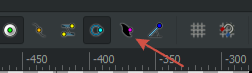

# Управление толщиной контура

Толщина контура определяет визуальную ширину линии и может изменяться как на уровне слоя, так и по длине самого контура.

### Включение и отключение управления шириной

Для переключения управления шириной следует щелкнуть на кнопку **Включить точки ширины** 

<figure><figcaption></figcaption></figure>

При отключённом управлении толщина линии остаётся постоянной по всей длине контура.\
При включённом управлении появляется возможность изменять толщину в отдельных точках контура.

#### Разница между Контуром и Супер-контуром

Слой **Контур** поддерживает базовое управление толщиной и предназначен для создания стандартных линий.

Слой **Супер-контур** предоставляет расширенные возможности:

* более гибкое управление толщиной;
* улучшенную интерполяцию значений;
* дополнительные параметры сглаживания.

**Супер-контур** рекомендуется использовать в случаях, когда требуется точная настройка формы и поведения линии.

Чтобы конвертировать один тип контура в другой:

1. На **Панели слоев** выберите нужный объект.
2. Нажмите **ПКМ** на нужный слой в **Панели слоёв** выберите **Создать слой** "**Контур"** (или **Создать слой "Супер-контур"**, в зависимости от цели), чтобы создать контур на базе существующей формы.

#### Инструмент Коррекции толщины

Для интерактивного изменения толщины используется инструмент **Коррекция толщины**.

С его помощью можно:

* изменять толщину в отдельных вершинах;
* создавать плавные переходы между участками разной толщины;
* анимировать изменение толщины вдоль контура.

Подробнее см. статью [Коррекция толщины](../instrumenty/korrekciya-tolshiny.md).
