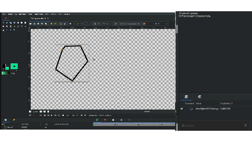

# Связывание контура и заливки

В Synfig Studio **Контуры** и **Заливки** привязываются друг к другу через механизм **связывания** параметров вершин.

Вот основные способы это сделать:

**1. Автоматически при создании**\
В инструменте **Кривые** на панели параметров инструмента отметьте галочками сразу и **Создать область**, и **Создать контур**. После завершения рисования Synfig создаст два слоя, чьи параметры вершин будут автоматически связаны.

**2. Из уже существующего слоя**\
Если у вас уже есть один из слоев, можно создать второй на его основе:

* Нажмите **ПКМ** на слой (например, **Область**) в панели слоев.
* Выберите **Создать слой Контур** (или наоборот — **Создать слой Область** из контура).
* Вершины нового слоя будут автоматически синхронизированы с исходным.&#x20;

<figure><figcaption></figcaption></figure>

**3. Вручную (для разных объектов)**\
Если нужно связать два уже готовых независимых слоя:

1. Выделите оба слоя в панели слоев (с зажатым `Ctrl`).
2. В панели параметров найдите строку **Вершины**.
3. Нажмите на нее **ПКМ** и выберите **Связать**.
   * _Важно:_ Чтобы связь работала корректно, **точки привязки** обоих слоев должны совпадать.&#x20;
