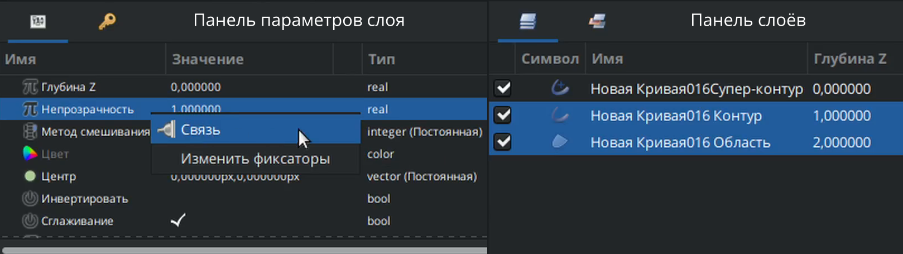
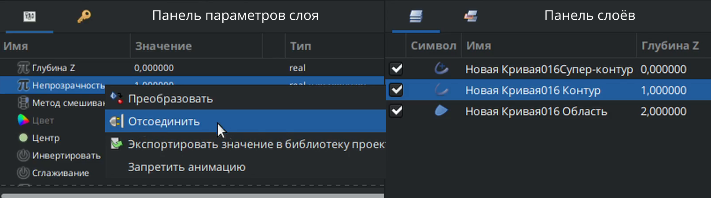

# Связывание параметров

Для **связывания** параметров двух и более слоев необходимо выполнить следующие действия:

1. Выделить необходимые слои в списке слоев;
2. На панели параметров слоя щелкнуть правой кнопкой мыши на нужном параметре;
3. Из контекстного меню выбрать пункт "**Связь**".

<figure><figcaption>
Связывание параметров
</figcaption></figure>

Для того чтобы **разорвать** связь параметров для одного из слоев необходимо выполнить следующие действия:

1. Выделить нужный слой.
2. В панели параметров слоя щелкнуть правой кнопкой мыши на связанном параметре.
3. Из контекстного меню выбрать пункт "**Отсоединить**".

<figure><figcaption>
Отсоединение параметров
</figcaption></figure>

##

* Экспорт параметров
* Конвертеры
